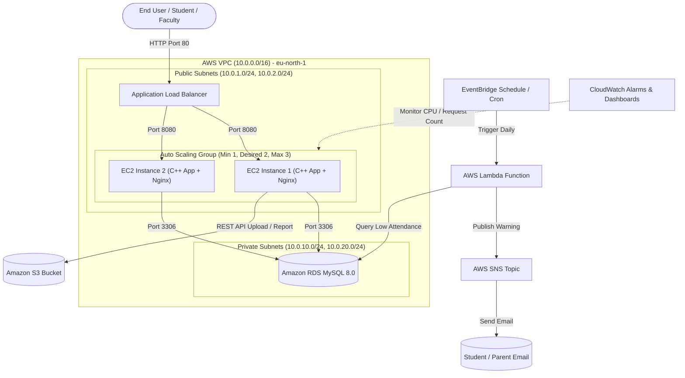

# Cloud-Based Student Attendance & Performance Management System

[](https://eu-north-1.console.aws.amazon.com/)
[]()
[]()
[]()

A complete, production-ready Cloud Computing course project deployed on **Amazon Web Services (AWS)**. Features a high-performance C++ backend, Amazon RDS MySQL in a private subnet, Amazon S3 storage, AWS Lambda automated background scanning, AWS SNS email notifications, and an Application Load Balancer with Auto Scaling.

---

## 🏗️ Cloud Architecture Diagram



---

## ⚡ Key Features & AWS Services Used

* **Amazon EC2 & Auto Scaling Group**: Deploys high-performance C++ web server behind Nginx in an Auto Scaling Group (Min 1, Desired 2, Max 3) across multiple Availability Zones.
* **Amazon RDS MySQL**: Managed relational database running in a private subnet, accessible only from the EC2 security group.
* **Amazon S3**: Private object storage for uploading lecture notes and exporting student attendance reports with Pre-Signed GET URLs.
* **AWS Lambda & EventBridge**: Serverless cron trigger that scans student records daily and flags students below 75% attendance.
* **AWS SNS (Simple Notification Service)**: Automated email notifications sent to students flagged with critical low attendance.
* **AWS CloudWatch**: Real-time CPU performance monitoring, application logging, and automated scaling alarms.

---

## 🔑 Demo Credentials for Viva Presentation

| Role | Email | Password | Description |
| :--- | :--- | :--- | :--- |
| **System Admin** | `admin@university.edu` | `Admin@123` | Full administrative control (Users & Subjects) |
| **Faculty Member** | `prof.sharma@university.edu` | `Faculty@123` | Mark daily attendance & enter academic grades |
| **Student (Normal)** | `student1@university.edu` | `Student@123` | High attendance (>90%) student view |
| **Student (Warning)**| `student13@university.edu` | `Student@123` | Low attendance (<50%) student with warning alert |

---

## 🚀 Quick Local Setup (Development)

```bash
# 1. Clone repo
git clone https://github.com/karthik-xd/Cloud-Based-Student-Attendance-and-Performance-Management-System-using-AWS.git
cd Cloud-Based-Student-Attendance-and-Performance-Management-System-using-AWS

# 2. Configure environment
cp .env.example .env

# 3. Import MySQL schema & seed data
mysql -u root -p < database/schema.sql
mysql -u root -p < database/seed.sql

# 4. Build & run C++ server
mkdir build && cd build
cmake ..
make
./cloud_student_system
```
Open browser at `http://localhost:8080`
