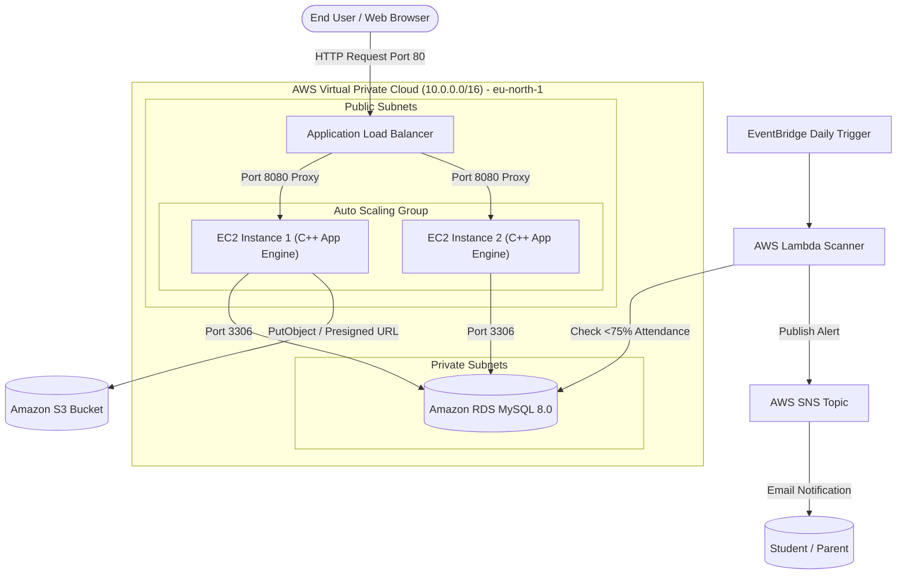

# Cloud System Architecture & Request Flow

## 🏗️ End-to-End System Architecture

---

## 🔢 Numbered Step-by-Step Request Flow

1. **User Request Initialization**: A user (Student or Faculty) submits a request via web browser to the public Application Load Balancer (ALB) URL.
2. **Load Balancing & SSL/TLS Termination**: The ALB receives the HTTP request on Port 80 and routes it using a round-robin algorithm to an active healthy EC2 instance inside the Auto Scaling Group.
3. **Nginx Reverse Proxying**: Nginx running on the EC2 instance receives the request and forwards it locally to port 8080 where the multi-threaded C++ web backend engine is listening.
4. **Session Authentication & CSRF Check**: The C++ Auth Handler verifies session tokens and CSRF parameters against in-memory session state and MySQL database records.
5. **Database Interaction (Private Subnet)**: The C++ Database Service connects securely over Port 3306 to the Amazon RDS MySQL instance located isolated inside private subnets.
6. **S3 Document / Report Export**: When exporting reports, the C++ S3 Service generates attendance CSV files, streams them to the private Amazon S3 bucket, and generates a time-limited Pre-Signed GET URL for client download.
7. **Automated Serverless Monitoring**: On a daily EventBridge schedule, AWS Lambda connects to Amazon RDS, finds students below the 75% threshold, and publishes alert messages to AWS SNS, which dispatches notification emails instantly.
