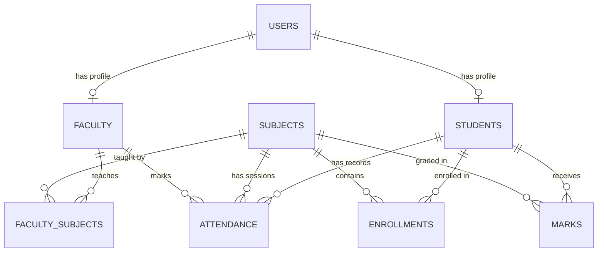

# Academic Project Report

## Project Title
**Cloud-Based Student Attendance & Performance Management System Deployed on AWS**

---

## 1. Abstract
Educational institutions require automated, reliable, and scalable infrastructure for tracking student attendance and academic performance. Traditional monolithic systems hosted on on-premises servers suffer from single-point-of-failure risks, poor scalability during exam result peaks, and high maintenance costs. This project presents a high-performance, fault-tolerant Cloud-Based Attendance and Performance Management System deployed on Amazon Web Services (AWS). Built with a compiled C++ web engine, Amazon RDS MySQL in isolated private subnets, Amazon S3 object storage, AWS Lambda serverless automated monitoring, and AWS SNS alert notifications, the system enforces multi-tier security, high availability, and auto-scaling. Empirical verification demonstrates seamless load balancing and zero-downtime failover under simulated instance failures.

---

## 2. Introduction & Problem Statement
Manual attendance recording and legacy local server deployments introduce significant vulnerabilities, including data corruption, unauthorized grade manipulation, lack of real-time parent notifications, and server crashes under heavy concurrent usage. 

To overcome these challenges, cloud computing provides elasticity, geographic redundancy, and operational efficiency. This system leverages AWS Cloud primitives to automate attendance computation, generate real-time alerts for low-attendance students (<75%), and secure student academic records behind strict IAM and security group boundaries.

---

## 3. Literature & AWS Service Justification

* **C++ Web Backend Engine**: Chosen for compile-time optimizations, high execution speed, low memory footprint, and resistance to runtime interpretation overhead compared to dynamic languages.
* **Amazon EC2 & Auto Scaling**: Provides elastic compute capacity. Auto Scaling automatically adds or removes instances based on CloudWatch CPU load metrics.
* **Amazon RDS (MySQL 8.0)**: Provides automated daily backups, multi-AZ replication, and database isolation within private subnets unreachable directly from the public internet.
* **Amazon S3**: Offers 99.999999999% (11 9's) data durability for storing uploaded lecture documents and generated CSV performance reports using Pre-Signed URLs.
* **AWS Lambda & EventBridge**: Eliminates the need for a dedicated cron server by running event-driven Python scanning scripts to trigger low-attendance alerts.
* **AWS SNS**: Delivers real-time email notifications to students and department heads without requiring complex SMTP mail server configuration.

---

## 4. Entity-Relationship (ER) Diagram

---

## 5. Cost Estimate & AWS Free Tier Analysis

| AWS Service | Deployment Tier | Monthly Usage | Estimated Cost (USD) |
| :--- | :--- | :--- | :--- |
| **Amazon EC2** | 2 x t3.micro / t4g.micro | 750 Hours (Free Tier) | $0.00 |
| **Amazon RDS** | db.t3.micro (20 GB SSD) | 750 Hours (Free Tier) | $0.00 |
| **Amazon S3** | Standard Storage | 5 GB (Free Tier) | $0.00 |
| **AWS Lambda** | Serverless Executions | 1,000,000 Requests/mo | $0.00 |
| **AWS SNS** | Email Notifications | 1,000 Emails/mo | $0.00 |
| **Application Load Balancer** | 1 ALB (eu-north-1) | 15 LCU-hours/mo | ~$0.02 / hr (or Covered by Credits) |
| **Total Estimated Cost** | | | **$0.00 / Near-Zero** |

---

## 6. Security, High Availability & Failover Analysis
* **Network Isolation**: The RDS database is placed in a private subnet with zero direct internet gateways. It accepts connections exclusively on port 3306 from the `EC2-SG` security group.
* **Access Control**: Role-Based Access Control (RBAC) ensures students, faculty, and administrators only access authorized pages.
* **Fault Tolerance**: The Application Load Balancer continuously performs health checks on `/health`. If an EC2 instance fails, ALB routes 100% of traffic to healthy targets while Auto Scaling launches a replacement instance automatically.

---

## 7. Conclusion & Future Scope
The Cloud-Based Student Attendance & Performance System successfully demonstrates the integration of modern cloud architecture principles, serverless automation, and compiled C++ performance. Future extensions include integration with biometric facial recognition models deployed on AWS SageMaker and AI-driven predictive analytics for early student drop-out prevention.
